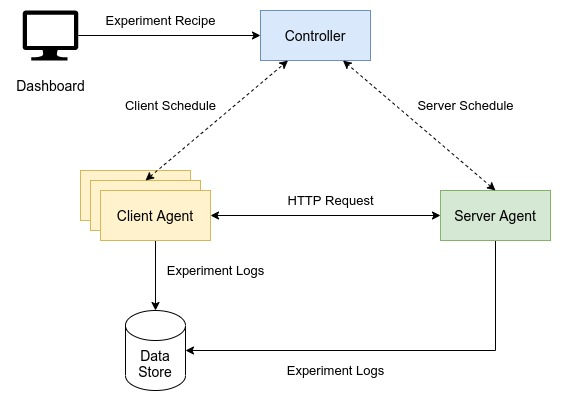

# ProtoCB Controller

## About
ProtoCB Test Bed includes a pool of <a href="https://github.com/ProtoCB/client-agent">client agents</a> interacting with a <a href="https://github.com/ProtoCB/server-agent">server agent</a>. The interaction is in accordance with a recipe that the ProtoCB controller feeds into the agents while scheduling experiments. This repository holds the code for the controller that is implemented as a NodeJS server.

Performance of different circuit breaking policies under different scenarios of server unavailabilities, client failures, network partitions and transient failures can be compared by performing experiments using ProtoCB. <a href="https://github.com/ProtoCB/client-agent">Client</a> and <a href="https://github.com/ProtoCB/server-agent">server</a> agents can be deployed as per the information provided on respective repository pages. Once deployed, all agents keep sending heartbeats to the controller. Controller registers this information and keeps track of the agent-wise status. Controller exposes an API to schedule experiments that can be specified using a recipe. <a href="https://github.com/ProtoCB/dashboard">ProtoCB Dashboard</a> can be used to connect to a deployed controller and then schedule experiments and keep track of experiment progress. Every agent produces logs during the course of an experiment and these logs are shipped to a firebase storage bucket. The logs can be analyzed offline to gain insights about circuit breaker policy efficay.

## High Level Design


### Example Recipe
```json
 {
	"experimentSession": "session-37",
	"description": "15 clients, one server, partition [7|8], GEDCB, 2 gossips every 250 ms",
	"eventsToLog": ["ERR", "SCH", "CBCHANGE", "F", "S", "GSUPDT", "GSSENT", "GSR", "GSREJECT"],
	"experimentClientCount": 15,
	"circuitBreakerType": "GEDCB",
	"circuitBreakerParameters": {
		"HFT": 6,
		"SFT": 2,
		"HOST": 2,
		"HOFT": 1,
		"WS": 10,
		"OD": 1000,
		"SST": 2,
		"maxAge": 5,
		"gossipPeriod": 250,
		"gossipCount": 2,
		"pushPullGossip": 0,
		"suspicionGossipCount": 2,
		"gsrMessageCount": 2,
		"minSetSize": 15,
		"setRevisionPeriod": 2000
	},
	"experimentStartTime": 1646403000,
	"experimentDuration": 22,
	"serverAvailabilitySchedule": [{
		"state": "ACTIVE",
		"time": 0
	}, {
		"state": "INACTIVE",
		"time": 21
	}],
	"networkPartitionSchedule": [{
		"networkPartitioned": true,
		"partitions": [{
			"clientCount": 7,
			"serverAccessible": true
		}, {
			"clientCount": 8,
			"serverAccessible": true
		}],
		"time": 7
	},{
		"networkPartitioned": false,
		"partitions": [],
		"time": 14
	}],
	"serverConfig": {
		"failureInferenceTime": 200,
		"tfProbability": 0
	},
	"clientGroups": [{
		"clientCount": 15,
		"minLatency": 25,
		"failureInferenceTime": 250,
		"tfProbability": 0,
		"requestRateSchedule": [{
			"rate": 20,
			"time": 0
		}],
		"clientLifeSchedule": [{
			"state": "ACTIVE",
			"time": 1
		},{
			"state": "INACTIVE",
			"time": 21
		}]
	}]
	
}
```